## 0. Install Istio

Installed istio with demo profile.

```bash
istioctl install --set profile=demo
```

## 1. Initial Setup

Here we create the required resources inside minikube (local k8s)

```bash
# creating namespaces
kubectl create ns web  
kubectl create ns httpbin
kubectl create ns keycloak
kubectl create ns istio-gateways

# enables automatic Istio sidecar injection
kubectl label ns httpbin istio-injection=enabled  
kubectl label ns web istio-injection=enabled  

# creating deployments and services to accept traffic
kubectl create deploy httpbin --image=kennethreitz/httpbin -n httpbin
kubectl create deploy nginx --image=nginx -n web  
kubectl expose deploy httpbin --port 80 -n httpbin  
kubectl expose deploy nginx --port 80 -n web
```

> When you set the `istio-injection=enabled` label on a namespace and the injection webhook is enabled, any new pods that are created in that namespace will automatically have a sidecar added to them.
## 2. Installing keycloak via Helm

define values in `values/keycloak-values.yaml`:

```yaml
auth:
  adminUser: admin
  adminPassword: admin

resources:
  requests:
    memory: 1Gi
  limits:
    memory: 2Gi
```

We will use helm to install and deploy keycloak

```bash
helm repo add bitnami https://charts.bitnami.com/bitnami  
helm repo update
helm install keycloak bitnami/keycloak -n keycloak -f values/keycloak-values.yaml
```

## 3. Generating credentials 

### 3.1 Port forwarding

Now port forward keycloak cluster IP so we can use it to generate client-credentials for our `oauth2-proxy` client

```
kubectl port-forward svc/keycloak -n keycloak 8080:80
```

### 3.2 Logging in

Now go to `http://localhost:8080/` and login with credentials defined in `keycloak-values.yaml`. 

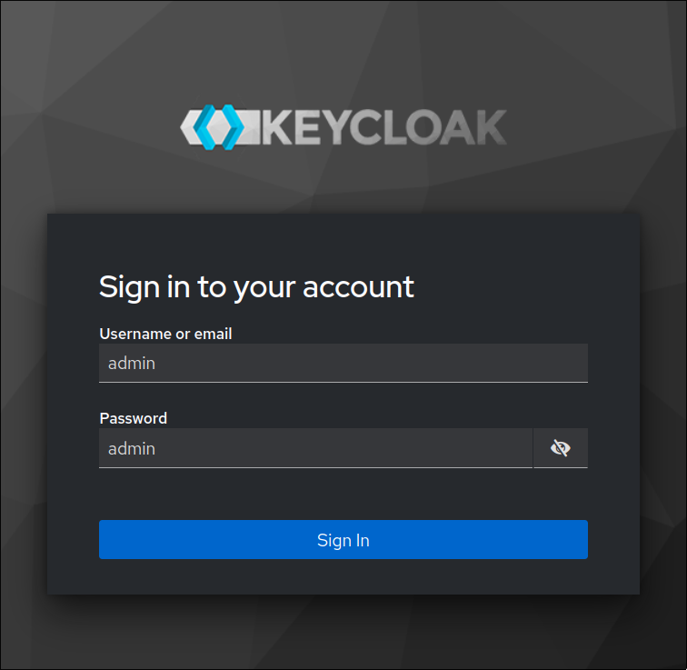

### 3.3 Creating a new Realm

Let's start by creating a new Realm called `istio`

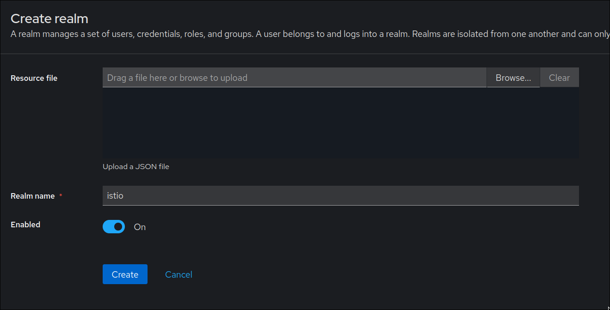

### 3.4 Creating a new client

Inside this realm we will create a new client called `istio` with `client-credentials` flow so our `oauth2-proxy` pod can connect to it.
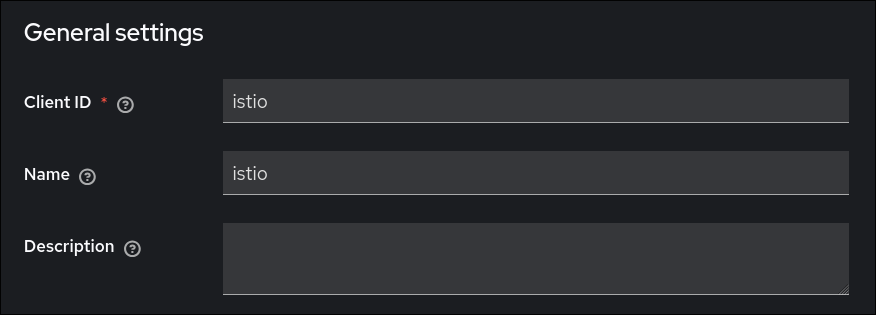
### 3.5 Configuring client-credentials flow 

Select the options as specified in the screenshot below:

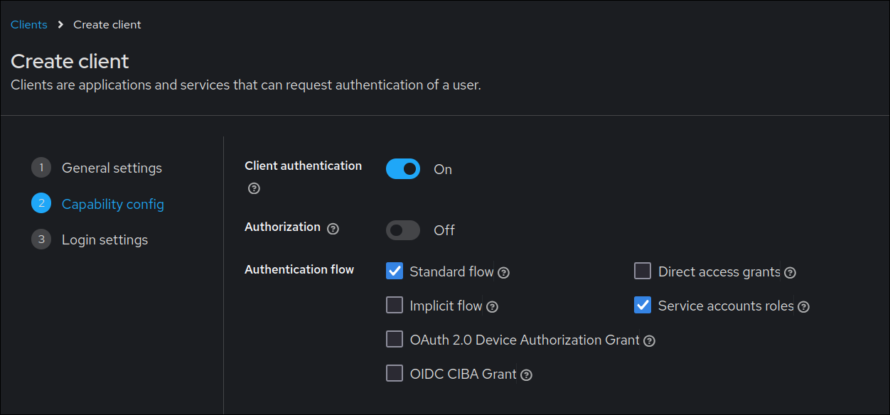

### 3.6 Specifying redirect URL

Now, we need to specify the valid redirect URL so keycloak can redirect us back to oauth2-proxy after successful login

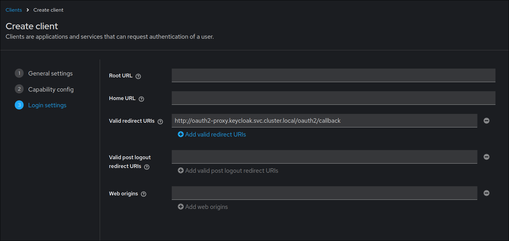

### 3.7 Creating and mapping client scope

Go to client scopes tab and click on `istio-dedicated` scope
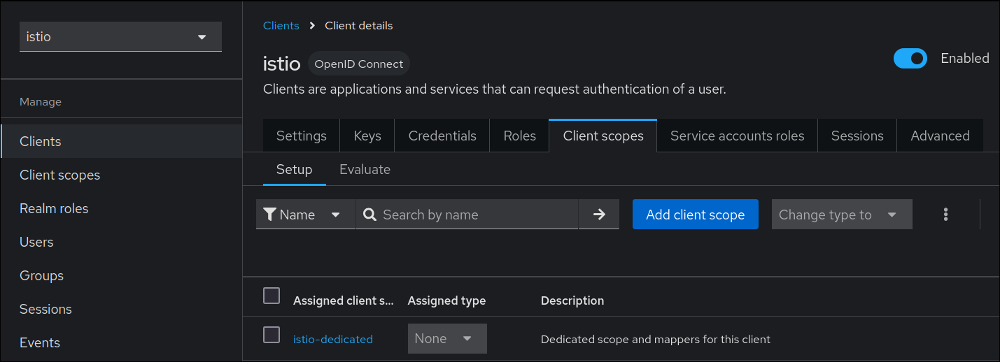

Click "Configure a new mapper" and select `Audience` option.

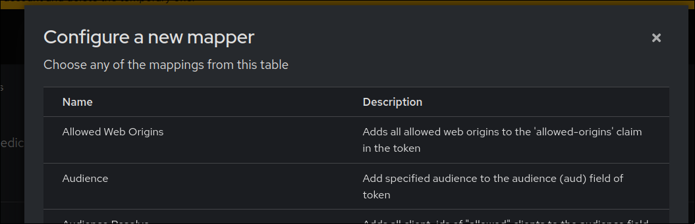

Set the Name field to `istio` and click save.

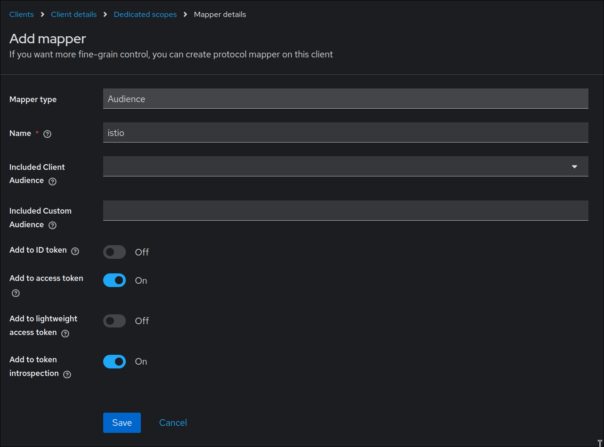

Verify mapper under `istio-dedicated` scope

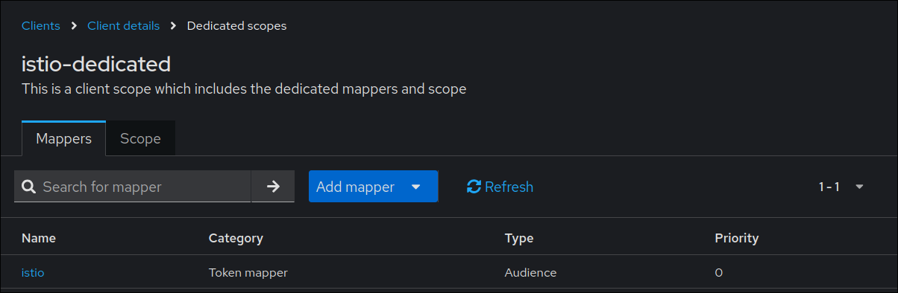

### 3.8 Creating a new user inside istio Realm

We would need to create a user to test our authentication under the istio realm.

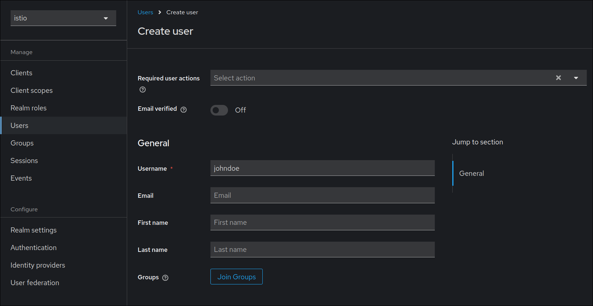

After creating, select the created user `johndoe` and go to credentials tab to set a password.

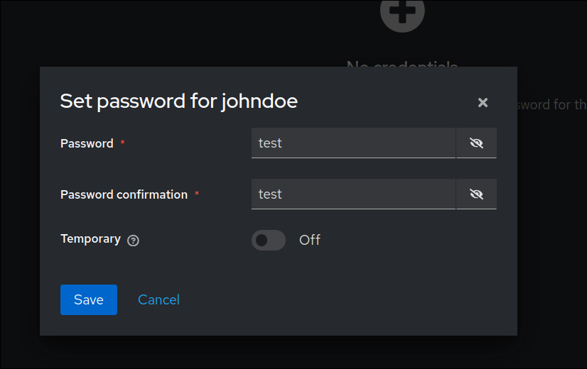

> Note: we can stop the port forward at this point once we are done with keycloak 
## 4. Deploy oauth2-proxy

create file `values/oauth2-proxy-values.yaml`

```yaml
configuration:
  whiteList: ".svc.cluster.local"

# must be reviewed on production environments
# please declare k8s secrets for all secrets  
extraArgs:
  - --client-id=istio
  - --client-secret=YNND6Fp5PImLqStCk7kJwxPtLB8TvmYT
  - --upstream=http://httpbin.httpbin.svc.cluster.local
  - --provider=oidc
  - --oidc-issuer-url=http://keycloak.keycloak.svc.cluster.local/realms/istio
  - --redirect-url=http://oauth2-proxy.keycloak.svc.cluster.local/oauth2/callback
  - --cookie-secret=aDRMRmhsU3pMeHFrQVJSeWFIcmYzMitURXQrS05KUUE=
  - --cookie-secure=false
  - --cookie-csrf-per-request=true
  - --cookie-csrf-expire=5m
  - --cookie-domain=.svc.cluster.local
  - --reverse-proxy=true
  - --insecure-oidc-allow-unverified-email=true
  - --pass-authorization-header=true
  - --set-authorization-header=true
  - --oidc-extra-audience=istio
  - --show-debug-on-error
```

> NOTE: This step is bit different from the article.
> Refer to: https://github.com/bitnami/charts/blob/main/bitnami/oauth2-proxy/values.yaml

Install `oauth2-proxy` via helm chart

```bash
helm repo add oauth2-proxy https://oauth2-proxy.github.io/manifests  
helm repo update
helm install oauth2-proxy oauth2-proxy/oauth2-proxy -n keycloak -f values/oauth2-proxy-values.yaml
```

Verify pod by running `kubectl get pods -nkeycloak`

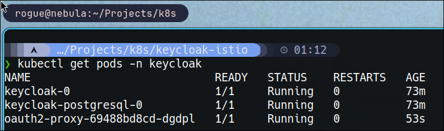

## 5. Configuring Istio and Ingress Gateway

### 5.1 Creating CRD(s)

Now, we have to create CRDs (Custom Resource Definitions) as per the article which "ensures the token was signed and is apart of the “istio” audience."

Create file `crds/request-authentication.yaml`

```yaml
---  
apiVersion: security.istio.io/v1beta1  
kind: RequestAuthentication  
metadata:  
  name: jwt-confirm  
  namespace: httpbin  
spec:  
  selector:  
    matchLabels:  
      app: httpbin  
  jwtRules:  
    - issuer: "http://keycloak.keycloak.svc.cluster.local/realms/istio"  
      jwksUri: "http://keycloak.keycloak.svc.cluster.local/realms/istio/protocol/openid-connect/certs"  
      audiences:  
        - "istio"
---  
apiVersion: security.istio.io/v1beta1  
kind: AuthorizationPolicy  
metadata:  
  name: verify-jwt  
  namespace: httpbin  
spec:  
  selector:  
    matchLabels:  
      app: httpbin  
  action: ALLOW  
  rules:  
    - from:  
        - source:  
            requestPrincipals: ["http://keycloak.keycloak.svc.cluster.local/realms/istio/*"]  
      when:  
        - key: request.auth.claims[aud]  
          values: ["istio"]
```

and apply using `kubectl apply -f crds/request-authentication.yaml`

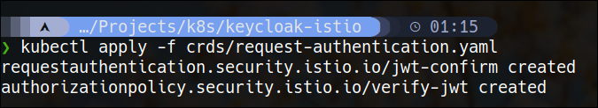

### 5.2 Configuring Istio Ingress 

create a file `crds/ingress-gateway.yaml`

```yaml
---
apiVersion: networking.istio.io/v1beta1
kind: Gateway
metadata:
  name: nginx
  namespace: istio-gateways
spec:
  selector:
    istio: ingressgateway
  servers:
  - port:
      number: 80
      name: http
      protocol: HTTP
    hosts:
    - nginx.web.svc.cluster.local
    - keycloak.keycloak.svc.cluster.local
    - oauth2-proxy.keycloak.svc.cluster.local
---
apiVersion: networking.istio.io/v1beta1
kind: VirtualService
metadata:
  name: oauth2-proxy
  namespace: istio-gateways
spec:
  gateways:
    - nginx 
  hosts:
  - "nginx.web.svc.cluster.local"
  http:
  - match:
    - uri:
        prefix: "/" 
    route:
    - destination:
        host: nginx.web.svc.cluster.local
        port:
          number: 80
---
apiVersion: networking.istio.io/v1beta1
kind: VirtualService
metadata:
  name: oauth2-proxy-keycloak
  namespace: istio-gateways
spec:
  gateways:
    - nginx
  hosts:
  - "keycloak.keycloak.svc.cluster.local"
  http:
  - match:
    - uri:
        prefix: "/" 
    route:
    - destination:
        host: keycloak.keycloak.svc.cluster.local
        port:
          number: 80
---
apiVersion: networking.istio.io/v1beta1
kind: VirtualService
metadata:
  name: oauth2-proxy-proxy
  namespace: istio-gateways
spec:
  gateways:
    - nginx
  hosts:
  - "oauth2-proxy.keycloak.svc.cluster.local"
  http:
  - match:
    - uri:
        prefix: "/"
    route:
    - destination:
        host: oauth2-proxy.keycloak.svc.cluster.local
        port:
          number: 80
```

and apply using `kubectl apply -f crds/ingress-gateway.yaml`

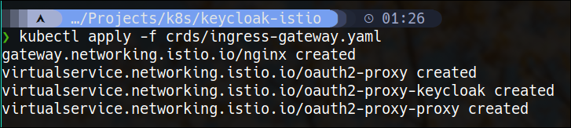

### 5.3 Verifying Ingress Gateway

Now that we have our ingress gateway deployed. You'll notice it creates a new service of `LoadBalancer` type under `istio-system` namespace.

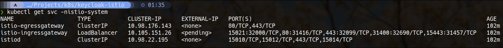
As, you can see EXTERNAL-IP is under pending state. Since we are working in a local minikube, we will utilize the metalLB minikube addon to assign an external IP to our ingress gateway's LoadBalancer.

### 5.4 Installing MetalLB

Enable the MetalLB addon by running:

```
minikube addons enable metallb
```

### 5.5 Configuring MetalLB

create file `configmaps/metallb-configmap.yaml`

```yaml
apiVersion: v1
kind: ConfigMap
metadata:
  namespace: metallb-system
  name: config
data:
  config: |
    address-pools:
    - name: default
      protocol: layer2
      addresses:
      - 192.168.49.100-192.168.49.120
```

apply using `kubectl apply -f configmaps/metallb-configmap.yaml`

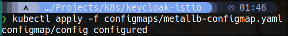

and verify using ` kubectl get svc -nistio-system`:

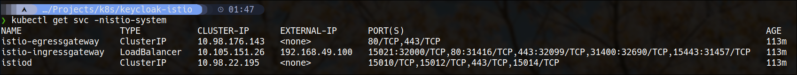
Voila! An external IP has been assigned.

> Note: Sometimes MetalLB address pools are flushed after system restarts. We can re-apply the metalLB configmap to fix this. 

### 5.6 Update `/etc/hosts` entries

Append the following entries to `/etc/hosts` file

```yaml
192.168.49.100      nginx.web.svc.cluster.local
192.168.49.100      oauth2-proxy.keycloak.svc.cluster.local
192.168.49.100      keycloak.keycloak.svc.cluster.local
```

### 5.7 Applying the EnvoyFilter

Now, we need to create the EnvoyFilter which handles the auth logic for our nginx pod.

create file `crds/envoy-filter.yaml`

```yaml
---
apiVersion: networking.istio.io/v1alpha3
kind: EnvoyFilter
metadata:
  name: oauth2-proxy-filter
  namespace: web
spec:
  workloadSelector:
    labels:
      app: nginx
  configPatches:
    - applyTo: HTTP_FILTER
      match:
        context: SIDECAR_INBOUND
        listener:
          filterChain:
            filter:
              name: "envoy.filters.network.http_connection_manager"
              subFilter:
                name: "envoy.filters.http.router"
      patch:
        operation: INSERT_BEFORE
        value:
          name: envoy.filters.http.ext_authz
          typed_config:
            "@type": type.googleapis.com/envoy.extensions.filters.http.ext_authz.v3.ExtAuthz
            http_service:
              server_uri:
                uri: http://oauth2-proxy.keycloak.svc.cluster.local:80
                cluster: outbound|80||oauth2-proxy.keycloak.svc.cluster.local
                timeout: 5s
              authorization_request:
                allowed_headers:
                  patterns:
                    - exact: "cookie"
                    - exact: "authorization"
              authorization_response:
                allowed_upstream_headers:
                  patterns:
                    - exact: "set-cookie"
                    - exact: "authorization"
```

### 5.8 Testing Ingress

We are done! Let's test the flow by going to `http://nginx.web.svc.cluster.local/` 

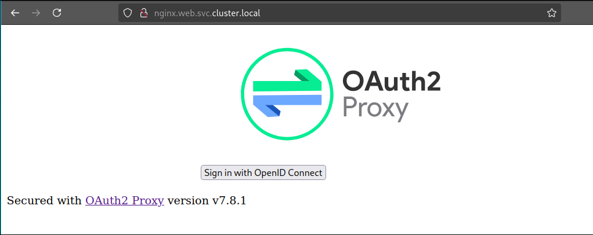

Nice! we got redirected to the oauth proxy login page. Lets try logging in with the `johndoe` user we created.

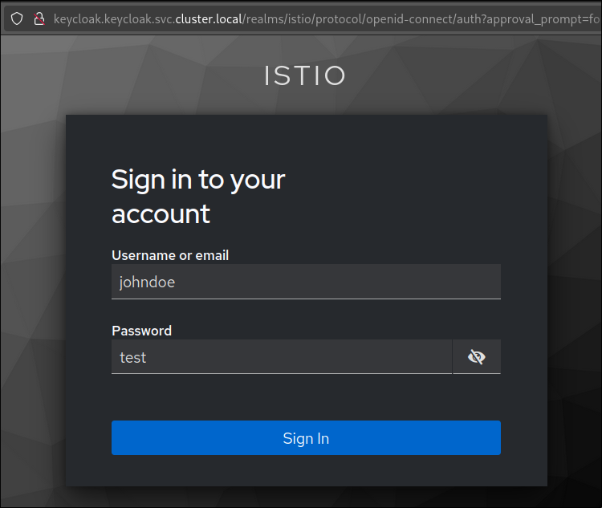

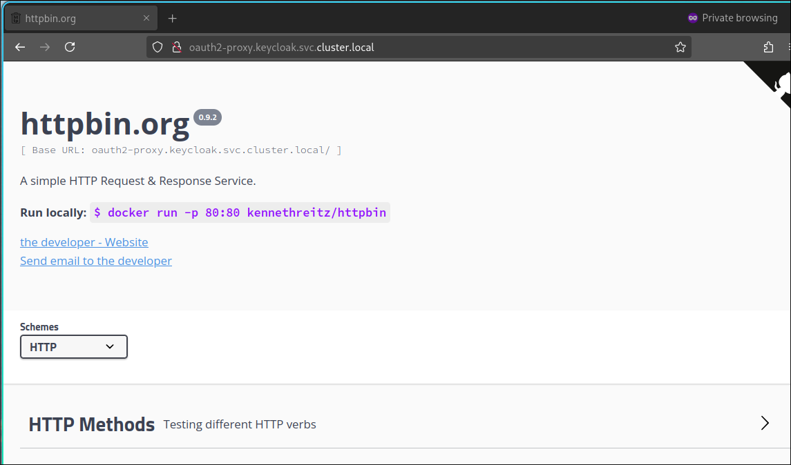
